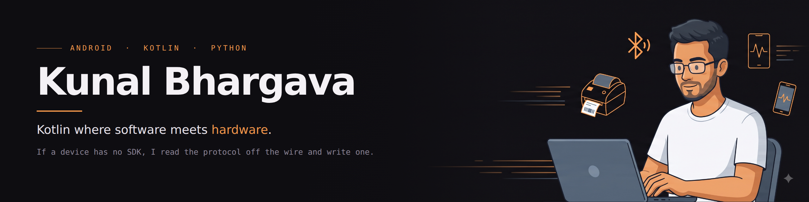

Android engineer. Most of my work sits where software meets hardware: Kotlin libraries that talk to devices over USB and Bluetooth, and the apps built on top of them.

When something has no SDK, I read the protocol off the wire and write one.

---

## What I've built

| Project | What it does | Stack |
| --- | --- | --- |
| **[NiimBridge](https://github.com/KunalBhargava182/OpenNiimbot-NiimBridge)** | Android driver, SDK and diagnostic app for NIIMBOT thermal label printers. Protocol recovered from an HCI capture and validated byte-identical against the official app. | Kotlin · Bluetooth SPP/BLE · AAR |
| **[ClickBaitn't Engine](https://github.com/KunalBhargava182/ClickBaitnt-Engine)** | Twelve-stage AI pipeline that finds trends, writes scripts, generates voice and video, and uploads to YouTube unattended. | Python · Gemini · Whisper · MoviePy · FFmpeg |
| **[Homify](https://github.com/KunalBhargava182/Homify-GroceryManager)** | Grocery and expiry tracking with offline storage and scheduled reminders. | Kotlin · Room · WorkManager · MVVM |
| **[AR Object Visualizer](https://github.com/KunalBhargava182/AR-Object-Visualizer)** | Real-time AR with plane detection and dynamic 3D model loading. | Kotlin · ARCore · Sceneform |
| **[FurHour](https://github.com/KunalBhargava182/FurHour-Your-Pets-Community-Android-Application)** *live on Play Store* | Social platform for pet owners: feed, chat, pet dating. | Kotlin · MVVM · Python backend |
| **[BeBroker](https://github.com/KunalBhargava182/BeBroker_A-Comprehensive-Real-Estate-Platform)** | Real estate brokerage app with advanced search. | Kotlin · Firebase · MVVM |

## What I work with

**Android** Kotlin · Jetpack Compose · XML/Views · MVVM · Coroutines & Flow · Room · WorkManager · Hilt · Retrofit · ARCore  
**Hardware** Bluetooth SPP/BLE · USB audio · AAR and SDK distribution  
**Testing** JUnit · Mockito · Espresso  
**Python / AI** Flask · Gemini · Whisper · MoviePy · FFmpeg · REST APIs  
**Tools** Git · GitHub Actions · Gradle · Android Studio · SQL

## Currently

- Making the ClickBaitn't pipeline produce videos worth watching, not just videos on schedule. Better hooks, better pacing, fewer things that break at 3am.
- Getting deeper into Android audio and Bluetooth: capture, streaming, and the parts of the stack where the documentation runs out.

## What I find interesting

Undocumented hardware. Legacy codebases that still earn their keep. Writing the documentation the vendor did not.

## Elsewhere

[LinkedIn](https://linkedin.com/in/kunal-bhargava182) · [YouTube](https://youtube.com/@ClickBaitnt) · kunalbhargava182@gmail.com
